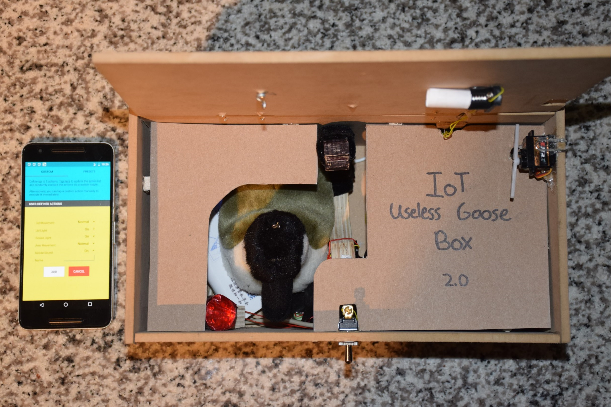
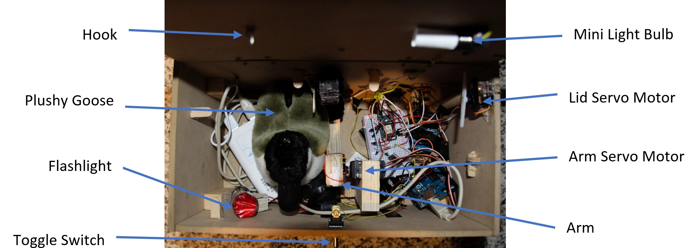
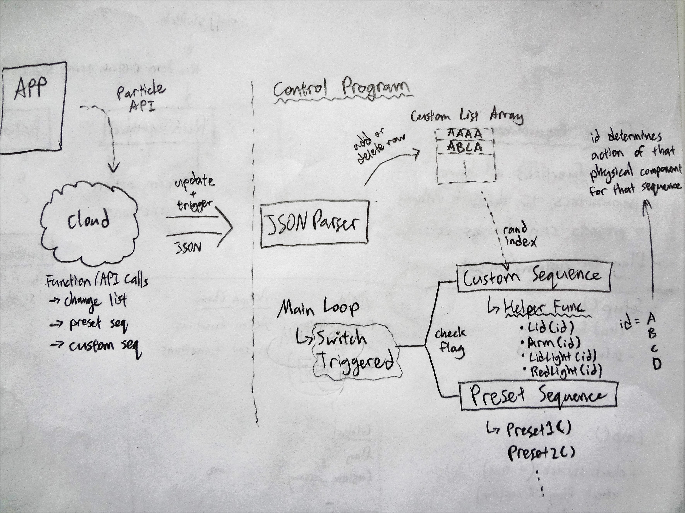
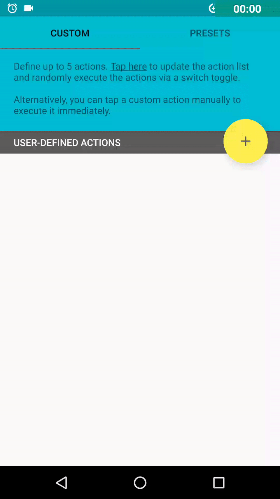

# IoT Useless Goose Box
<!-- INTRO -->

Have you ever seen one of those <a href="https://www.youtube.com/watch?v=aqAUmgE3WyM">videos</a> of a box that simply turns itself off after being turned on by a user and thought, "...How useless?"  Well we've found a way to make that box just a little less... useless!  

This year's <b>2016 EngHack Winner</b>, is a Waterloo themed <i>useless box</i> that uses an intuitive Android app to incorporate user customization.  This not only incorporates awesome IoT functionality, but additionally gives the user the power to remotely define new patterns in which the box can turn itself off; via an array of light bulbs, speakers, and servo motors.

#Here Is How We Did It
<h2>Materials</h2>
<h4>HARDWARE</h4>
<ul>
  <li>Particle Photon</li>
  <li>Arduino Uno Kit</li>
  <li>Toggle Switch</li>
  <li>3 Relays</li>
  <li>Speaker (Goose Quacking)</li>
  <li>2 Servo Motors</li>
  <li>Mini Light bulb</li>
  <li>Flashlight</li>
  <li>Plushy Goose</li>
  <li>Wood</li>
  <li>Nails</li>
  <li>Soldering Iron & Solder</li>
  <li>Metal Hinges</li>
  <li>Hook</li>
  <li>Cardboard</li>
</ul>
<h4>SOFTWARE</h4>
<ul>
  <li>Android Studio: Java</li>
  <li>Particle Dev: C++/Arduino/Particle</li>
</ul>

<!-- BOX  -->
<h2>Building the Box</h2>
  

The box's encasing was made from plywood sheets.  The lid of the box was secured with hinges; allowing it to easily rotate open with a sevrvo motor.  A thicker piece of wood was carefully measured out to create the arm, which was fastened to a second servo motor.  Both servos were secured to the inside faces of the box.  

A combination of scrap wood, hot glue, and screws were used to fasten the switch, LED, light bulb, speaker, and hook to hold the goose to the inside of the box.  Tools used included the drill press, band saw, and sanders.

<!-- CONTROL PROGRAM  -->
<h2>Control Program</h2>

The control program of the GooseBot was written in such a way that allows the user's box to open in one of two ways: with preset patterns or patterns designed by the user.

<h4>Main Loop</h4>

A main loop is continuously run that checks whether or not the box's physical switch has been turned on.  When it has, a pattern is randomly chosen from an array of either pre-set or custom patterns and used to open the box. The Android app sends in a flag which toggles between the preset and custom modes.

<h4>Pattern Definition</h4>

Each custom pattern is a combination of 5 actions that include the actuation of the mini light bulb, flashlight, lid, arm, and goose speaker. Various combinations of these actions make up the patterns the box performs before turning itself off. Each action can vary in the way in which it actuates as follows:

<h5>Flashlight and Mini Light Bulb</h5>
<ul>
  <li>On</li>
  <li>Delayed On</li>
  <li>Off</li>
  <li>Flicker</li>
</ul>
<h5>Servo Motors for Arm and Lid</h5>
<ul>
  <li>Normal</li>
  <li>Fast</li>
  <li>Slow</li>
  <li>Shake</li>
</ul>
<h5>Goose Speaker</h5>
<ul>
  <li>On</li>
  <li>Off</li>
</ul>

Each of the actuation methods correlates to a <i>char</i>, from letter <i>A</i> up to <i>D</i>. When a pattern is created the 5 letters are saved as a string and added to an array of custom or pre-set patterns. The <i>main loop</i> then uses this array from which to randomly select a pattern to perform. The letters are parsed into actions in order, following the format:  Mini Light Bulb, Flashlight, Lid, Arm, Goose Sound

<!-- ANDROID APPLICATION  -->
<h2>App</h2>

The companion Android app source code can be found <a href="https://github.com/uzbhutta/Android-IoTUselessGooseBox">here</a>. The app consists of two main pages (fragments) accessible via swiping. 

The two fragments above are housed in a FrameLayout in the MainActivity, and are swiped between thanks to a FragmentManager in conjunction with a TabLayout.

The Custom fragment allows users to define their own custom actions for when the GooseBox's switch is turned 'on'. The user can customize all the aspects of the GooseBox by pressing the yellow floating action button. At any time, the user can tap on a custom action they've created in the list, and the GooseBox immediately runs the action. Alternatively, they can press the prompt at the top of the page to randomly cycle through their custom-defined actions on each GooseBox 'on' toggle. 

The Preset fragment houses four advanced presets that exist in the GooseBox control program. As in the Custom fragment, the user can tap on an action to see the GooseBox perform it immediately. Alternatively, they can press the prompt at the top of the page to randomly cycle through the preset actions on each GooseBox 'on' toggle.

